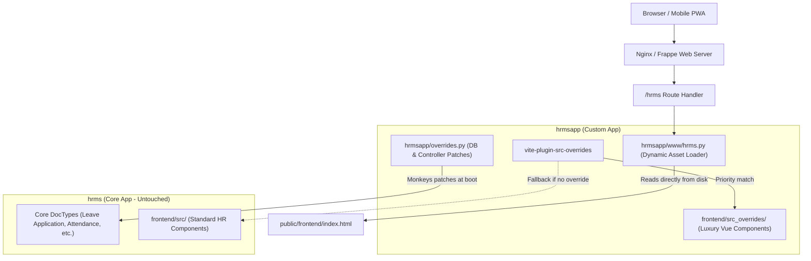

# Kalika HRMS (`hrmsapp`)

A luxury-branded, non-destructive extension and override app for **Frappe HR (`hrms`)**, tailored specifically for **Kalika Jewels**.

This app extends core Frappe HR with a custom emerald-and-gold design system, full white-label branding, automated MariaDB 12 database compatibility patches, and a zero-downtime dynamic asset-loading architecture that completely eliminates PWA blank-screen errors.

---

## Table of Contents

- [Architectural Overview](#architectural-overview)
- [How Overrides Work](#how-overrides-work)
  - [1. Frontend File-Resolution Overrides (`src_overrides/`)](#1-frontend-file-resolution-overrides-src_overrides)
  - [2. Dynamic Frontend Serving (Permanent Blank-Screen Fix)](#2-dynamic-frontend-serving-permanent-blank-screen-fix)
  - [3. Backend DocType & Method Overrides](#3-backend-doctype--method-overrides)
  - [4. MariaDB 12 Database Compatibility Engine](#4-mariadb-12-database-compatibility-engine)
  - [5. Template & Web Route Precedence](#5-template--web-route-precedence)
- [Luxury Emerald & Gold Design System](#luxury-emerald--gold-design-system)
- [Directory Structure](#directory-structure)
- [Development & Build Workflow](#development--build-workflow)
- [Troubleshooting & Maintenance](#troubleshooting--maintenance)

---

## Architectural Overview

Frappe HR (`hrms`) is an upstream core app. Modifying core `apps/hrms` directly causes merge conflicts, upgrade friction, and broken git tracking.

`hrmsapp` solves this by applying all customizations **strictly from an outside-in, layered override pattern**:



---

## How Overrides Work

### 1. Frontend File-Resolution Overrides (`src_overrides/`)

The PWA frontend is powered by **Vue 3**, **Ionic**, **Tailwind CSS**, and **Vite**.

Rather than modifying upstream `src/` files directly, `hrmsapp` introduces a custom Vite pre-plugin in [`frontend/vite.config.js`](frontend/vite.config.js): **`srcOverridesPlugin()`**.

#### How it works:
1. When Vite compiles any component (e.g. `@/views/Login.vue` or `@/components/QuickLinks.vue`), `srcOverridesPlugin()` intercepts the module resolution.
2. It checks whether a matching file path exists inside `frontend/src_overrides/`.
3. If an override exists in `src_overrides/`, Vite seamlessly bundles that version into the build.
4. If no override exists, it transparently falls back to `src/`.

**Example:**
- Core component: `frontend/src/views/Login.vue`
- Luxury override: `frontend/src_overrides/views/Login.vue`
- Result: The compiled bundle serves the Kalika Jewels luxury emerald/gold login interface.

---

### 2. Dynamic Frontend Serving (Permanent Blank-Screen Fix)

#### The Problem:
Modern frontend builds use cache-busting chunk hashes (e.g., `index-DjOoH1Nz.js`). When asset hashes change on build or git pull, static HTML files like `www/hrms.html` often hold stale hashes, resulting in **404 Not Found** errors for missing JS chunks. Because modern single-page apps cannot recover from failed dynamic imports, the browser displays a **blank white screen**.

#### The Permanent Solution:
In [`hrmsapp/www/hrms.py`](hrmsapp/www/hrms.py), Frappe dynamically reads the compiled [`hrmsapp/public/frontend/index.html`](hrmsapp/public/frontend/index.html) directly from disk at request time:

```python
# hrmsapp/www/hrms.py
def get_context(context):
    csrf_token = frappe.sessions.get_csrf_token()
    frappe.db.commit()
    context.csrf_token = csrf_token
    context.boot = get_boot()
    context.site_name = frappe.local.site
    context.base_template = None

    # Dynamically load the compiled index.html directly from disk
    index_path = frappe.get_app_path("hrmsapp", "public", "frontend", "index.html")
    if os.path.exists(index_path):
        with open(index_path, "r", encoding="utf-8") as f:
            raw_html = f.read()
        context.app_html = frappe.render_template(raw_html, context)
    return context
```

And in [`hrmsapp/www/hrms.html`](hrmsapp/www/hrms.html):
```html

{{ app_html | safe }}

<!-- Fallback static tags -->

<!-- </body> -->
```

**Benefits:**
- Whenever `yarn build` runs and generates new chunk hashes, the server immediately serves the fresh asset references.
- No git merge conflicts on compiled asset hashes.
- Zero manual HTML editing required after builds.

---

### 3. Backend DocType & Method Overrides

Frappe HR controllers are extended in [`hrmsapp/overrides.py`](hrmsapp/overrides.py) and registered in [`hrmsapp/hooks.py`](hrmsapp/hooks.py).

#### Controller Class Override:
```python
# hrmsapp/hooks.py
override_doctype_class = {
    "Leave Application": "hrmsapp.overrides.CustomLeaveApplication"
}
```

#### Runtime Hook:
```python
# hrmsapp/hooks.py
before_request = ["hrmsapp.overrides.patch_all"]
```

This ensures that whenever Frappe handles HTTP requests or background jobs, custom validations and patches are guaranteed to be active in memory.

---

### 4. MariaDB 12 Database Compatibility Engine

#### The Issue:
In MariaDB 12+, `to_date` became a reserved SQL keyword. Core Frappe HR contains queries in `Leave Application` and `tabLeave Ledger Entry` where `to_date` is not enclosed in backticks (e.g. `where to_date >= %(from_date)s`). This causes database syntax errors (`1064 (42000): You have an error in your SQL syntax near 'to_date'`).

#### The Fix in `hrmsapp`:
1. **Targeted Method Replacements:**
   - Overrode `LeaveApplication.validate_leave_overlap` with backticked SQL columns (`` `from_date` `` and `` `to_date` ``).
   - Overrode `hrms.hr.doctype.leave_application.leave_application.get_leave_entries`.
2. **Global SQL Sanitizer Patch:**
   [`hrmsapp/overrides.py`](hrmsapp/overrides.py) patches `frappe.database.database.Database.sql` and `Database._transform_query` using regex to automatically quote standalone occurrences of `to_date`:
   ```python
   TO_DATE_PATTERN = re.compile(r"(?<![`:\w])(?<!%\()(?<!%\b)\bto_date\b(?![\(`])", re.IGNORECASE)
   ```
   Any SQL query executed by any module that mentions `to_date` as a column identifier is safely rewritten to `` `to_date` `` before reaching the MariaDB cursor.

---

### 5. Template & Web Route Precedence

Frappe determines template search order using `reversed(installed_apps)`.

1. **`installed_apps` Order:** In the database `tabSingles`, `hrmsapp` is ordered **after** `hrms`:
   ```json
   ["frappe", "erpnext", "hrms", "hrmsapp"]
   ```
2. **Template Precedence in `hooks.py`:**
   ```python
   template_apps = ["hrmsapp", "hrms", "erpnext", "frappe"]
   ```
   This guarantees that any template in `hrmsapp/www/` or `hrmsapp/templates/` takes precedence over core HRMS equivalents.

---

## Luxury Emerald & Gold Design System

Kalika Jewels requires a premium jewelry-brand aesthetic. The UI has been tailored across all components in `frontend/src_overrides/`:

- **Primary Brand Color:** Deep Royal Emerald (`#064e3b`, `#022c22`, `#047857`)
- **Accent & Highlight Color:** Polished Gold (`#d97706`, `#b45309`, `#f59e0b`, `#fef3c7`)
- **Key Overridden Components:**
  - `src_overrides/views/Login.vue`: Luxury emerald gradient header, Kalika Jewels emblem, custom gold focus states.
  - `src_overrides/components/icons/FrappeHRLogo.vue`: Replaced default Frappe HR icon with the official Kalika Jewels emblem.
  - `src_overrides/components/QuickLinks.vue`: Polished emerald cards with high-contrast icons for Salary Slips, Leave Applications, and Expense Claims.
  - `src_overrides/components/TabButtons.vue`: High-contrast gold tabs for team requests and status filters.
  - `src_overrides/components/AttendanceCalendar.vue`: Clear, colored badges for Present (Green), Absent (Red), and Half Day (Amber).

---

## Directory Structure

```
apps/hrmsapp/
├── README.md                      # Comprehensive documentation
├── package.json                   # Root build script for bench integration
├── frontend/
│   ├── package.json               # Frontend dependencies & build commands
│   ├── vite.config.js             # Vite configuration with srcOverridesPlugin & base path
│   ├── index.html                 # Source template for Vite
│   ├── src/                       # Base frontend source code
│   └── src_overrides/             # Custom luxury overrides (takes precedence over src/)
│       ├── main.css               # Luxury theme CSS tokens & styling
│       ├── components/            # Overridden Vue components
│       └── views/                 # Overridden Views (Login, Dashboards, etc.)
└── hrmsapp/
    ├── hooks.py                   # Frappe hooks (doctype overrides, before_request, etc.)
    ├── overrides.py               # MariaDB 12 patch & leave application controllers
    ├── public/
    │   └── frontend/              # Compiled Vite production bundle
    │       ├── index.html         # Compiled entry HTML with current chunk hashes
    │       └── assets/            # Content-hashed JS & CSS chunks
    └── www/
        ├── hrms.py                # Dynamic asset loader for /hrms route
        └── hrms.html              # Template wrapper invoking context.app_html
```

---

## Development & Build Workflow

### 1. Building the Frontend

Whenever changes are made to files in `frontend/src/` or `frontend/src_overrides/`, rebuild the frontend assets:

```bash
cd /Users/karthikpolisetty/Desktop/makeit/hrms/frappe-bench/apps/hrmsapp/frontend
yarn build
```

This executes:
1. `vite build --base=/assets/hrmsapp/frontend/` (outputs to `hrmsapp/public/frontend/`)
2. `yarn copy-html-entry` (synchronizes `hrmsapp/www/hrms.html`)

### 2. Clearing Frappe Cache

After code or doctype updates:

```bash
bench --site hrmsapp clear-cache
```

### 3. Running Bench Build

To build all apps across the bench:

```bash
bench build
```

---

## Troubleshooting & Maintenance

### Blank Page in Browser
1. **Rebuild the Frontend:**
   ```bash
   cd apps/hrmsapp/frontend && yarn build
   ```
2. **Hard Refresh Browser:**
   - **macOS:** `Cmd + Shift + R`
   - **Windows / Linux:** `Ctrl + Shift + R`
   - (Or test in an Incognito window to bypass stale Service Worker caching)

### Git Repository & Branch
- **Remote URL:** `https://github.com/karthik3854k/hrmsapp.git`
- **Active Branch:** `develop`
- **Author Identity:** `karthik3854k` (`polisettykarthik3@gmail.com`)
